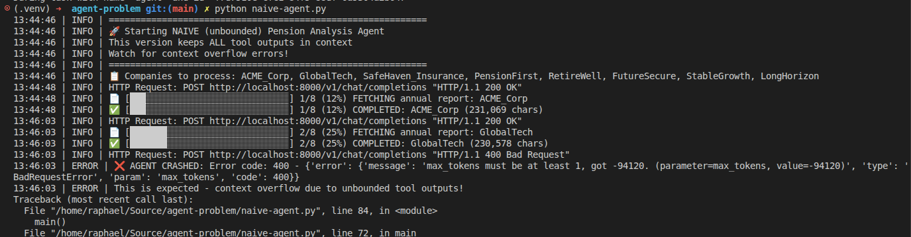
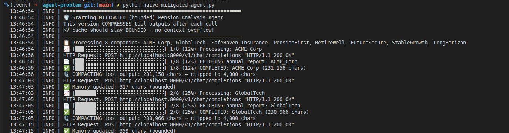
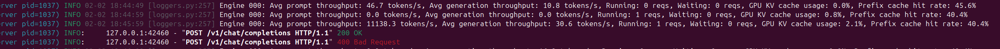
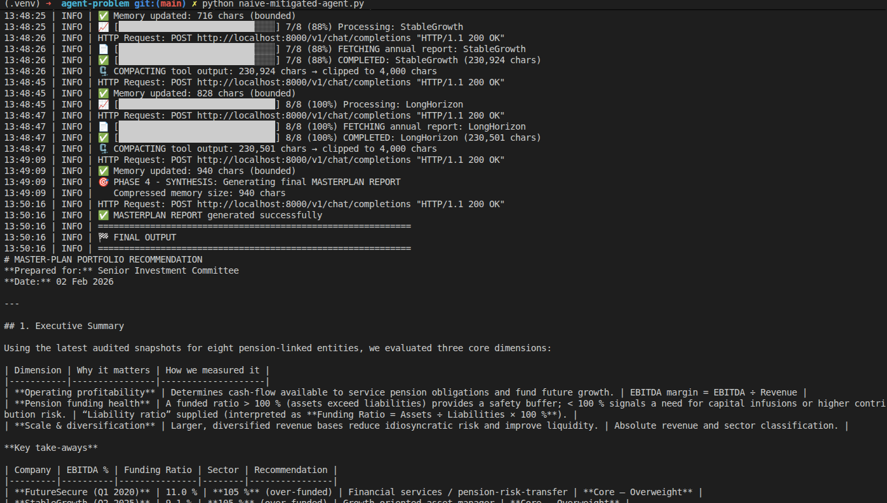
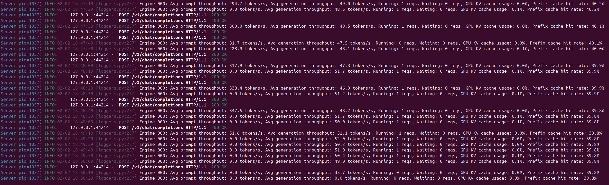

# KV Cache Saturation Demo

Simulates the **"Pension Analysis" workload** that causes 120B models to destabilize due to unbounded context growth in agentic loops.

> **Context**: This repo was created to demonstrate the issue described in the [NVIDIA Developer Forums thread](https://forums.developer.nvidia.com/t/tier-0-findings-on-dgx-spark-why-hybrid-mamba-nemotron-beats-120b-for-agents-plus-sm121-fix/359275) about why hybrid Mamba (Nemotron) outperforms 120B transformer models for long-running agents.

## The Problem

When running multi-step agentic workflows on large language models (like `gpt-oss-120b`), the **KV cache grows unbounded** with each tool call. A typical "Pension Analysis" workflow involves:

1. **Ingest** - Parse multiple 50+ page PDF Annual Reports (Heavy RAG)
2. **Analysis** - Extract financial tables and sentiment per company
3. **Compute** - Run Monte Carlo simulations (10k runs, 30yr horizon)
4. **Synthesis** - Aggregate all findings into a "Masterplan" report

By Phase 4, the accumulated context exceeds the model's limits, triggering:
- **Context Overflow**: `max_tokens must be at least 1, got -94365`
- **KV Cache Saturation**: GPU memory exhausted, system swaps to disk
- **Coherence Decay**: Inference drops to 0.1 t/s, model "forgets" earlier data

## Two Implementations

### 1. Naive Agent (`naive-agent.py`)
The **unbounded** implementation that demonstrates the failure mode:
- Uses LangGraph's `create_react_agent`
- Keeps **ALL tool outputs** in message history
- Accumulates ~150KB per company × 8 companies = 1.2MB+ of context
- **Expected behavior**: Context overflow error (`max_tokens must be at least 1, got -N`)

### 2. Mitigated Agent (`naive-mitigated-agent.py`)
The **bounded context** version that survives the full workflow:
- Uses LangGraph `StateGraph` with custom memory management
- After each tool call, **compresses output** to ≤1200 chars of key facts
- Replaces raw `ToolMessage` with `[tool_output_compacted]` stub
- KV cache stays bounded regardless of document count
- **Expected behavior**: Completes successfully with stable memory usage

## Screenshots

### Naive Agent Running


The naive agent starts processing companies. Progress bar shows advancement through the 8-company workflow. Each `fetch_annual_report` call adds ~150KB to context.

### Mitigated Agent Running  


The mitigated agent processing the same workload. Note the compression step after each tool call that keeps context bounded.

### vLLM Logs - Naive Agent (Context Growth)


vLLM server logs showing the context size growing with each iteration. Watch the token counts increase until the context window is exceeded.

### Mitigated Agent Completion


The mitigated agent successfully completes the full workflow and generates the MASTERPLAN REPORT. The compressed memory contains all key facts without raw document text.

### vLLM Logs - Mitigated Agent (Stable Context)


vLLM server logs showing **stable context size** throughout execution. The memory compactor keeps the KV cache bounded, enabling the full workflow to complete.

## Requirements

```
langgraph
langchain
langchain-openai
```

## Setup

1. Install dependencies:
   ```bash
   pip install -r requirements.txt
   ```

2. Set environment variables:
   ```bash
   export OPENAI_API_KEY=EMPTY  # for local vLLM
   export MODEL=openai/gpt-oss-120b
   ```

3. Ensure vLLM is running on `localhost:8000`

## Usage

Run the naive agent (will crash):
```bash
python naive-agent.py
```

Run the mitigated agent (will complete):
```bash
python naive-mitigated-agent.py
```

## Key Takeaways

| Aspect | Naive Agent | Mitigated Agent |
|--------|-------------|-----------------|
| Context Growth | Unbounded (~150KB/company) | Bounded (~1.2KB/company) |
| Memory Usage | Exceeds GPU VRAM | Stable |
| Completion | ❌ Crashes at ~75% | ✅ Full completion |
| Coherence | Degrades as context grows | Maintained via compression |

## Related Discussion

See the full discussion on the [NVIDIA Developer Forums](https://forums.developer.nvidia.com/t/tier-0-findings-on-dgx-spark-why-hybrid-mamba-nemotron-beats-120b-for-agents-plus-sm121-fix/359275) about:
- Why Hybrid Mamba (Nemotron) architectures handle this better
- DGX Spark performance characteristics
- The sm121 fix for compute capability issues

## License

MIT
